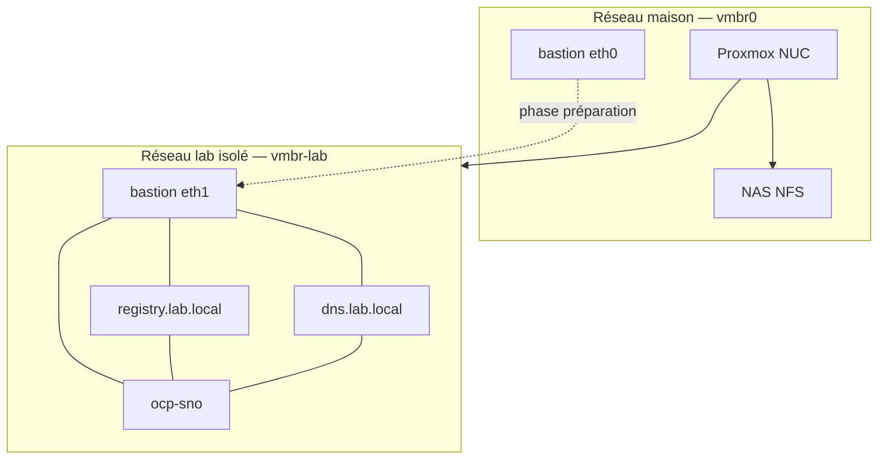

# Architecture du lab

## Vue d'ensemble

## Phases

### Phase A — Préparation (bastion avec Internet)

1. Installer `oc` et `openshift-install` (même version que la release OCP cible).
2. Récupérer le pull secret Red Hat (`cloud.redhat.com`).
3. Miroir des images vers le registry local — voir [mirror/README.md](../mirror/README.md).
4. Préparer `install-config.yaml` et `agent-config.yaml`.

### Phase B — Installation air-gap

1. Démarrer DNS et registry sur `vmbr-lab`.
2. Vérifier résolution DNS et accès HTTPS au registry depuis la bastion.
3. Générer l'ISO : `openshift-install agent create image`.
4. Booter la VM OpenShift sur l'ISO.
5. `openshift-install agent wait-for install-complete`.

## Dimensionnement VMs (SNO)

| VM | vCPU | RAM | Disque |
|----|------|-----|--------|
| bastion | 2 | 4–8 Go | 40 Go |
| dns | 1 | 1 Go | 10 Go |
| registry | 2 | 4–8 Go | 120–200 Go |
| ocp-sno | 8–12 | 32–40 Go | 120–150 Go |

## Dimensionnement VMs (3 nœuds — étape suivante)

| VM | vCPU | RAM | Disque |
|----|------|-----|--------|
| ocp-node-0..2 | 4–6 | 16 Go | 80–100 Go |

## Choix stockage

Toutes les VMs sont sur **NFS** (NAS). Acceptable pour apprendre l'air-gap ; performances I/O sous-optimales pour etcd en charge.
