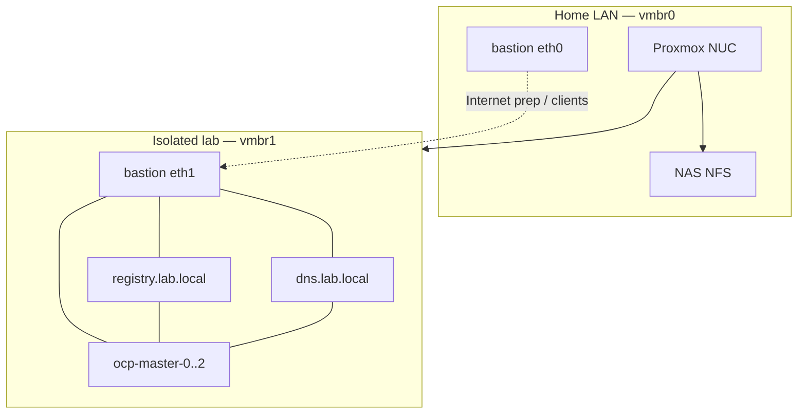

# Lab architecture

Design reference for **Day 0**. Procedures: [../deploy/DAY0.md](../deploy/DAY0.md) → [DAY1](../deploy/DAY1.md) → [DAY2](../deploy/DAY2.md).

## Overview

## Official stages → lab

| Red Hat Day | Lab |
|-------------|-----|
| Day 0 Design | Topology, sizing, Proxmox/templates/secrets — [../deploy/DAY0.md](../deploy/DAY0.md) |
| Day 1 Deployment | VMs, mirror, agent install → Ready — [../deploy/DAY1.md](../deploy/DAY1.md) |
| Day 2 Operations | Catalog, OSUS, LVMS, Virt — [../deploy/DAY2.md](../deploy/DAY2.md) |

## VM sizing (NUC 64 GiB)

| VM | vCPU | RAM | Disk |
|----|------|-----|------|
| bastion | 2 | 8 GiB | 40 GiB NFS |
| dns | 1 | 1–2 GiB | ~10 GiB NFS |
| registry | 2 | 4–8 GiB | OS + data on `local-lvm` |
| ocp-master-0..2 (compact3) | 8 | 16 GiB each | 120G OS + 100G LVMS |

SNO alternative: one node ~8 cores / 24 GiB — [../../terraform/lab-ocp/README.md](../../terraform/lab-ocp/README.md)

## Storage

- Infra (dns/bastion): NFS `nfs_vm`
- Registry + OCP disks: `local-lvm`
- ISOs: `nfs_iso`

## Related

- [network.md](network.md) · [bastion.md](bastion.md) · [versions.md](versions.md)
