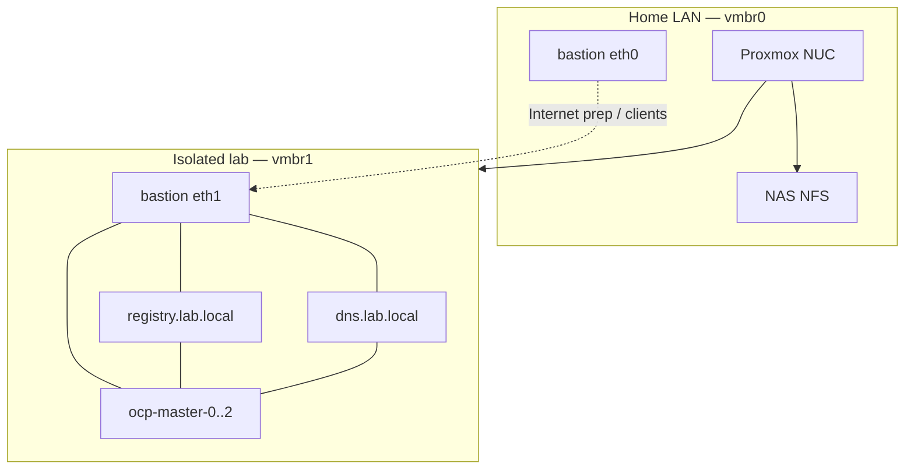

# Lab architecture

Design reference for **Day 0**. Procedures: [../deploy/DAY0.md](../deploy/DAY0.md) → [DAY1](../deploy/DAY1.md) → [DAY2](../deploy/DAY2.md).

## Why Proxmox for now

This lab runs on **Proxmox VE** for now, **while waiting to resolve RHEL / NAS NFS issues** that blocked a cleaner RHEL-centric layout (guest and registry disks on the NAS were too slow / unstable for OpenShift etcd and the mirror registry).

Proxmox is therefore the practical host: VMs on mixed storage (`nfs_vm` for light infra, **`local-lvm`** on the NUC SSD for OCP + registry). Revisit a RHEL-only hosting model once NFS performance (or an alternative shared storage) is fixed — see [Storage](#storage) below.

## Overview

## Official stages → lab

| Red Hat Day | Lab |
|-------------|-----|
| Day 0 Design | Topology, sizing, Proxmox/templates/secrets — [../deploy/DAY0.md](../deploy/DAY0.md) |
| Day 1 Deployment | VMs, mirror, agent install → Ready — [../deploy/DAY1.md](../deploy/DAY1.md) |
| Day 2 Operations | Catalog, OSUS, LVMS, Virt — [../deploy/DAY2.md](../deploy/DAY2.md) |

## VM sizing (NUC 64 GiB)

| VM | vCPU | RAM | Disk |
|----|------|-----|------|
| bastion | 2 | 8 GiB | 40 GiB NFS |
| dns | 1 | 1–2 GiB | ~10 GiB NFS |
| registry | 2 | 4–8 GiB | OS + data on `local-lvm` |
| ocp-master-0..2 (compact3) | 8 | 16 GiB each | 120G OS + 100G LVMS |

SNO alternative: one node ~8 cores / 24 GiB — [../../terraform/lab-ocp/README.md](../../terraform/lab-ocp/README.md)

## Storage

| Datastore | Used for | Why |
|-----------|----------|-----|
| **`nfs_vm`** (NAS) | dns, bastion OS disks + template `rhel10-nfs` | Enough for light infra; frees NUC SSD |
| **`nfs_iso`** (NAS) | RHEL DVD, agent ISO | Shared ISO library |
| **`local-lvm`** (NUC SSD) | **registry** + **OCP** disks + template `rhel10-tpl` | Performance — see below |

Details: [../../terraform/README.md](../../terraform/README.md) · templates: [../../proxmox/rhel-cloudinit-template.md](../../proxmox/rhel-cloudinit-template.md)

### Why OCP and registry are not on the NAS NFS

Same NFS limitation that keeps the lab on **Proxmox + local-lvm** for heavy disks (see [Why Proxmox for now](#why-proxmox)).

This lab **does not** put OpenShift (RHCOS) or the mirror registry data disks on the NAS NFS. Lab experience: NFS latency and IOPS are too weak for:

- **etcd** and control-plane disks on OCP nodes (timeouts, slow API, unstable Ready)
- **Registry** image blobs / frequent small writes under `oc-mirror` and cluster pulls

Those VMs therefore use **`local-lvm`** on the NUC internal SSD (`storage_perf`).  
dns/bastion stay on **`nfs_vm`**: low I/O, acceptable on NFS.

Do **not** move OCP or registry back to NFS “to save SSD space” without expecting install/runtime pain. Two RHEL templates exist so EFI/OS stay on the same datastore as each clone (NFS vs SSD mix).

## Related

- [network.md](network.md) · [bastion.md](bastion.md) · [versions.md](versions.md) · [../faq/README.md](../faq/README.md)
